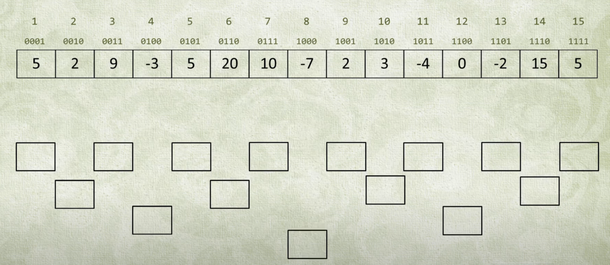
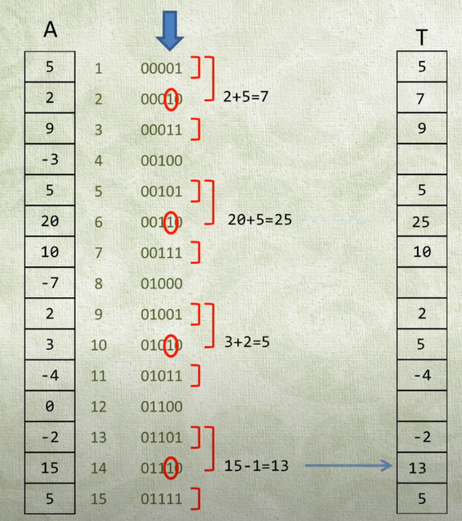
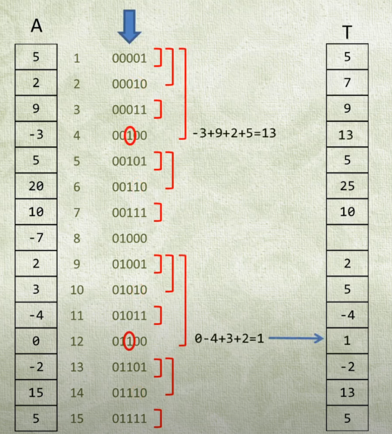
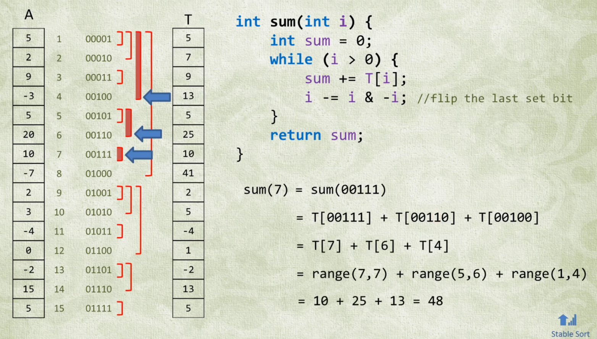

# Binary Indexed Tree

.png>)E:\Projects\algorithm.gitbook\assets\bit.pngaka Fenwick Tree.

## Motivation

Fenwick tree was proposed to solve the [mutable range sum query problem](https://leetcode.com/problems/range-sum-query-mutable/).

It supports:

* Fast point update in `O(logN)` time
* Range Query in `O(logN)` time

Note that in addition to range sum, we can also use BIT to calculate range **multiplication**, range **xor**, range **maximum number**, range **minimum number** etc.

## Binary Indexed

<figure><figcaption></figcaption></figure>

BIT nodes are indexed using the lowbit of their original index.

<figure><figcaption></figcaption></figure>

For those with lowest bits at index 0 (we count the bit index from the right), the value is directly saved into BIT. These are the leaf nodes of the BIT.

<figure><figcaption></figcaption></figure>

For those with lowest bits at index 1, they are located at the 2nd layer from the bottom. We not only add their own values to BIT, but also add their child values to it. Their child indices are one less than their own indices. For example, `node[2]` (00010) has `node[1]` (00001) as its child, so `node[2] = A[2] + node[1] = 2 + 5 = 7`

<figure><figcaption></figcaption></figure>

For those with lowest bits at index 2,  they are located at the 3rd layer from the bottom. For example, `node[4]` (00100) has `node[3]` (00011) and `node[2]` (00010) as its direct children, so `node[4] = A[4] + node[3] + node[2] = -3 + 9 + 7 = 13`

<figure><figcaption></figcaption></figure>

## Sum Query

<figure><figcaption></figcaption></figure>

To calculate `sum(7) = A[1] + ... + A[7]`, we keep finding previous ranges by removing the lowbit from `7 = 111`. So, `sum(111) = node(111) + node(110) + node(100) = node[7] + node[6] + node[4]`

<figure><figcaption></figcaption></figure>

Another example, `sum(8) = sum(1000) = node(1000) = node[8]`

## Update

<figure><figcaption></figcaption></figure>

To add `10` to `A[4]`, we need to update all the nodes containing`A[4]`. We find such nodes by adding lowbit. So, `A[4]` is contained by `node[100] = node[4]` and `node[1000] = node[8]`.

## Note

`N + 1` elements.

When querying, keep REMOVING low bit. (find the previous intervals)

When updating, keep ADDing low bit. (updating the tree towards higher levels)

## Implementation

```cpp
// Author: github.com/lzl124631x
class BIT {
    vector<int> sum;
    static inline int lowbit(int x) { return x & -x; }
public:
    BIT(int N) : sum(N + 1) {};
    // Add delta to A[i]
    void update(int i, int delta) { // Note: this `i` is 1-based.
        for (; i < sum.size(); i += lowbit(i)) sum[i] += delta;
    }
    // Return A[0] + ... + A[i]
    int query(int i) { // Note: this `i` is 1-based.
        int ans = 0;
        for (; i; i -= lowbit(i)) ans += sum[i];
        return ans;
    }
    // Return A[i] + ... + A[j]
    int rangeQuery(int i, int j) { // Note: these `i` and `j` are 1-based.
        return query(j) - query(i - 1);
    }
};
```

The implementation for [307. Range Sum Query - Mutable (Medium)](https://leetcode.com/problems/range-sum-query-mutable/)

```cpp
// OJ: https://leetcode.com/problems/range-sum-query-mutable/
// Author: github.com/lzl124631x
// Time: 
//      NumArray: O(N^2 * logN)
//      update: O(logN)
//      sumRange: O(logN)
// Ref: https://www.youtube.com/watch?v=WbafSgetDDk
class BIT {
    vector<int> sum;
    static inline int lowbit(int x) { return x & -x; }
public:
    BIT(int N) : sum(N + 1) {};
    void update(int i, int delta) {
        for (; i < sum.size(); i += lowbit(i)) sum[i] += delta;
    }
    int query(int i) {
        int ans = 0;
        for (; i; i -= lowbit(i)) ans += sum[i];
        return ans;
    }
    int rangeQuery(int i, int j) {
        return query(j) - query(i - 1);
    }
};
class NumArray {
    BIT tree;
    vector<int> nums;
public:
    NumArray(vector<int>& nums) : nums(nums), tree(nums.size()) {
        for (int i = 0; i < nums.size(); ++i) tree.update(i + 1, nums[i]);
    }

    void update(int i, int val) {
        tree.update(i + 1, val - nums[i]);
        nums[i] = val;
    }

    int sumRange(int i, int j) {
        return tree.rangeQuery(i + 1, j + 1);
    }
};
```

The implementation for [1649. Create Sorted Array through Instructions (Hard)](https://leetcode.com/problems/create-sorted-array-through-instructions/)

```cpp
// OJ: https://leetcode.com/problems/create-sorted-array-through-instructions/
// Author: github.com/lzl124631x
// Time: O(NlogM) where M is the range of A[i]
// Space: O(M)
// Ref: https://leetcode.com/problems/create-sorted-array-through-instructions/discuss/927531/JavaC%2B%2BPython-Binary-Indexed-Tree
int c[100001] = {};
class Solution {
public:
    static inline int lowbit(int x) { return x & -x; }
    int createSortedArray(vector<int>& A) {
        memset(c, 0, sizeof(c));
        int ans = 0, N = A.size(), mod = 1e9 + 7;
        for (int i = 0; i < N; ++i) {
            ans = (ans + min(get(A[i] - 1), i - get(A[i]))) % mod;
            update(A[i]);
        }
        return ans;
    }
    void update(int x) {
        for (; x < 100001; x += lowbit(x)) c[x]++;
    }
    int get(int x) { // returns the sum of numbers smaller than x
        int ans = 0;
        for (; x > 0; x -= lowbit(x)) ans += c[x];
        return ans;
    }
};
```

## Problems

* [307. Range Sum Query - Mutable (Medium)](https://leetcode.com/problems/range-sum-query-mutable/)
* [1649. Create Sorted Array through Instructions (Hard)](https://leetcode.com/problems/create-sorted-array-through-instructions/)

## Reference

* [https://leetcode.com/problems/range-sum-query-mutable/discuss/75753/Java-using-Binary-Indexed-Tree-with-clear-explanation](https://leetcode.com/problems/range-sum-query-mutable/discuss/75753/Java-using-Binary-Indexed-Tree-with-clear-explanation)
* [https://www.topcoder.com/community/competitive-programming/tutorials/binary-indexed-trees/](https://www.topcoder.com/community/competitive-programming/tutorials/binary-indexed-trees/)
* [https://oi-wiki.org/ds/fenwick/](https://oi-wiki.org/ds/fenwick/)
* [https://www.youtube.com/watch?v=WbafSgetDDk](https://www.youtube.com/watch?v=WbafSgetDDk)
* [https://visualgo.net/en/fenwicktree](https://visualgo.net/en/fenwicktree)
* [https://www.luogu.com.cn/problem/solution/P3374](https://www.luogu.com.cn/problem/solution/P3374)
* [树状数组（Binary Indexed Tree），看这一篇就够了](https://blog.csdn.net/Yaokai\_AssultMaster/article/details/79492190)
