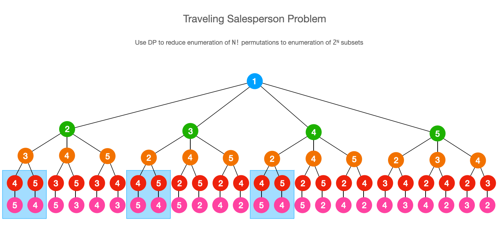

# Travelling Salesperson Problem

The Travelling Salesperson Problem is a classic DP problem. 

The brute force solution is to enumerate all `N!` permutations of nodes.

To eliminate repetitive computations, we need to observe the fact that there is only one optimal answer (i.e. cost) for a subset of nodes, so we can memoize the optimal answer for subsets of nodes. In this way, instead of enumerating on all `N!` permutations, we just enumerate on all `2^N` subsets.

## Problems

* [1879. Minimum XOR Sum of Two Arrays (Hard)](https://leetcode.com/problems/minimum-xor-sum-of-two-arrays/)
