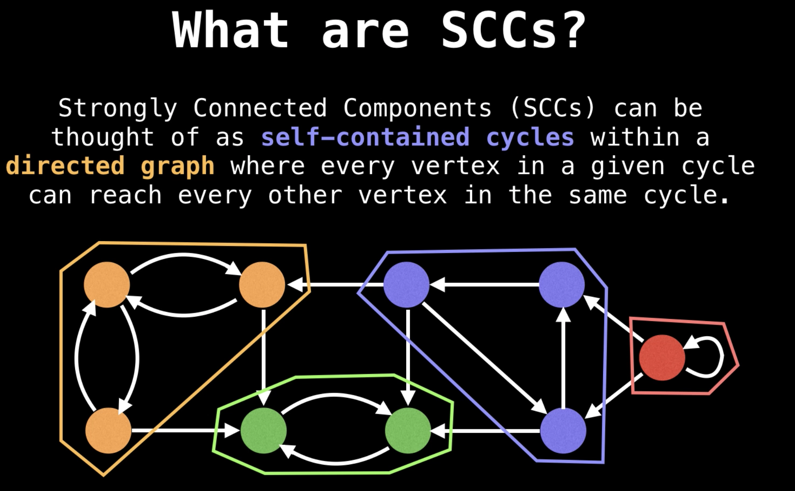
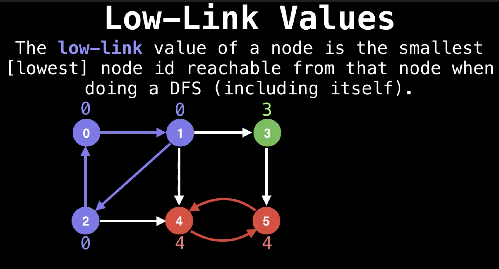

# Tarjan Algorithm

Tarjan's strongly connected components algorithm is an algorithm in graph theory for finding the **strongly connected components (SCCs)** of a directed graph. It runs in linear time, matching the time bound for alternative methods including Kosaraju's algorithm and the path-based strong component algorithm. The algorithm is named for its inventor, Robert Tarjan.

## References

* https://en.wikipedia.org/wiki/Tarjan%27s_strongly_connected_components_algorithm
* [Tarjans Strongly Connected Components algorithm | Graph Theory
](https://youtu.be/TyWtx7q2D7Y)

## Problems

* [1192. Critical Connections in a Network (Hard)](https://leetcode.com/problems/critical-connections-in-a-network/)