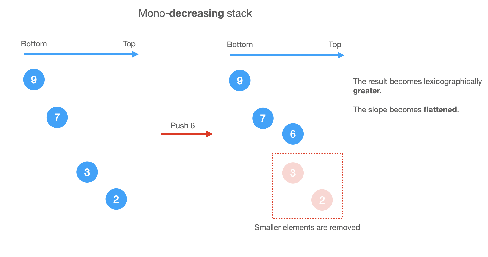

# Monotonic Stack

A monotonic stack is a stack whose elements are monotonically increasing or descreasing.

Sometimes we store the index of the elements in the stack and make sure the elements corresponding to those indexes in the stack forms a mono-sequence.

## Increasing or decreasing?

If we need to pop **smaller** elements from the stack before pushing a new element, the stack is **decreasing** from bottom to top.

Otherwise, it's **increasing** from bottom to top.

For example,

```
Mono-decreasing Stack

Before: [5,4,2,1]
To push 3, we need to pop smaller (or equal) elements first
After: [5,4,3]
```

## Notes

For a mono-**decreasing** stack:
* we need to pop **smaller** elements before pushing.
* it keep tightening the result as lexigraphically **greater** as possible. (Because we keep popping smaller elements out and keep greater elements).



Take [402. Remove K Digits (Medium)](https://leetcode.com/problems/remove-k-digits/) for example, since we are looking for lexigraphically **smallest** subsequence, we should use mono-**increasing** stack.

## Problems

* [402. Remove K Digits (Medium)](https://leetcode.com/problems/remove-k-digits/)
* [496. Next Greater Element I \(Easy\)](https://leetcode.com/problems/next-greater-element-i/)
* [1019. Next Greater Node In Linked List \(Medium\)](https://leetcode.com/problems/next-greater-node-in-linked-list/)
* [503. Next Greater Element II \(Medium\)](https://leetcode.com/problems/next-greater-element-ii/)
* [1475. Final Prices With a Special Discount in a Shop \(Easy\)](https://leetcode.com/problems/final-prices-with-a-special-discount-in-a-shop/)
* [84. Largest Rectangle in Histogram \(Hard\)](https://leetcode.com/problems/largest-rectangle-in-histogram/)
* [85. Maximal Rectangle \(Hard\)](https://leetcode.com/problems/maximal-rectangle/)
* [456. 132 Pattern \(Medium\)](https://leetcode.com/problems/132-pattern/)
* [1504. Count Submatrices With All Ones \(Medium\)](https://leetcode.com/problems/count-submatrices-with-all-ones/)
* [1673. Find the Most Competitive Subsequence (Medium)](https://leetcode.com/problems/find-the-most-competitive-subsequence/)
* [907. Sum of Subarray Minimums (Medium)](https://leetcode.com/problems/sum-of-subarray-minimums/)